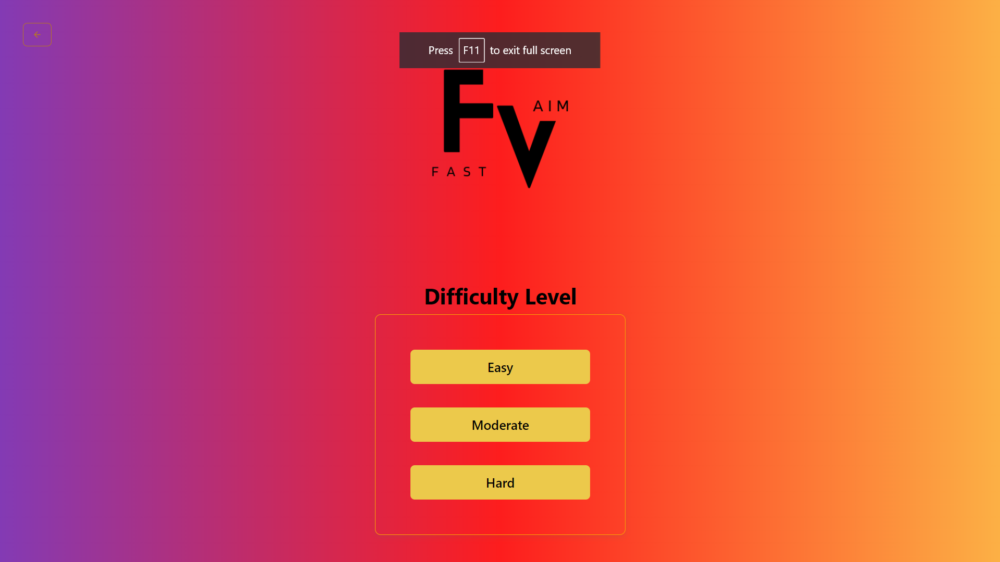
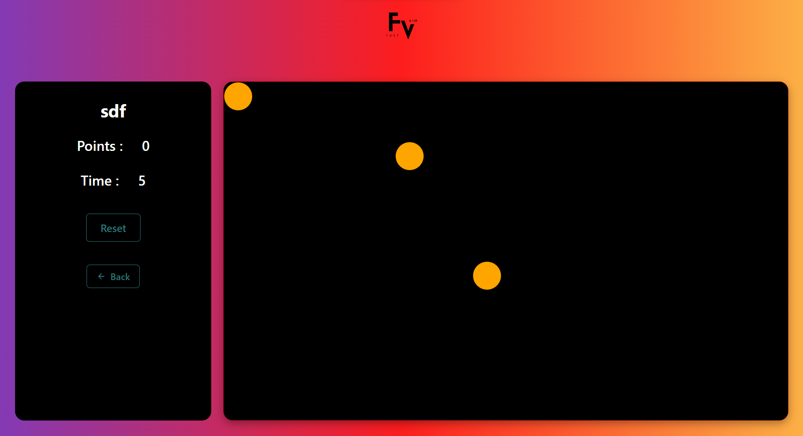
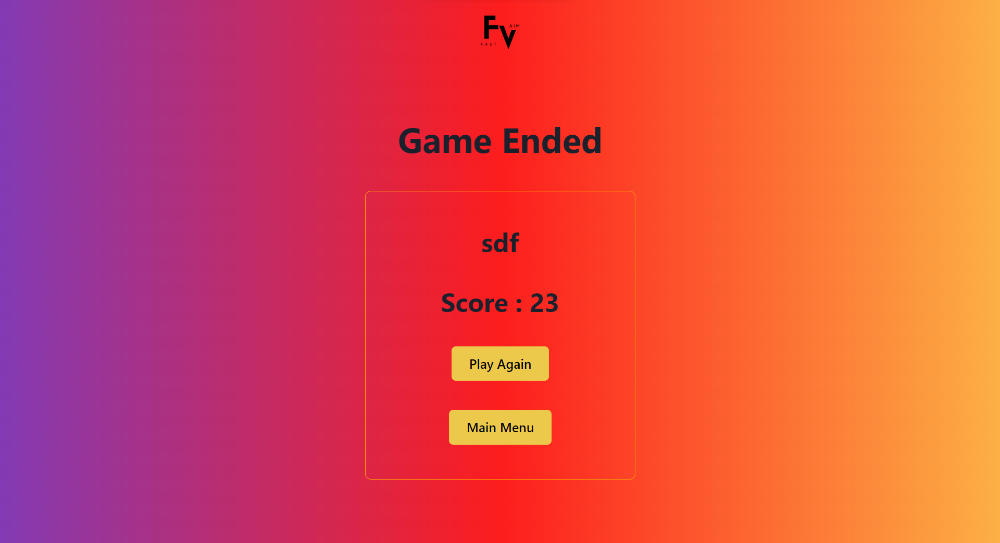

---
<!-- (https://user-images.githubusercontent.com/94675329/222920940-719d4c75-975c-4233-8292-5768d808edcf.png) -->

Some Glimps of Our Gaming Project :

# Welcome to FASTAIM

<h3>Fast Aim is a gaming Website that allows playing both Single Player and Multi-Player. This is a collaborative project; we completed this website in 3 days.</h3>

# Deployed URL 👉 [Click here]()

## Our Team Members

- Subha Mukherjee (My Linkedin profile :- https://www.linkedin.com/in/subha-mukherjee-652a551ba/)

- Suneet Panigrahi (My Linkedin profile :- https://www.linkedin.com/in/suneetpanigrahi25/)

- Abhishek Jha (My Linkedin profile :-https://www.linkedin.com/in/abhishek-jha-430055231/)

-Atanu Karmakar (My Linkedin profile :- https://www.linkedin.com/in/atanu-karmakar-7ab110227/)
 

 
<h4 align="center">💻 Tech Stack</h4>
 

 
 
 
 
   
  

 

<h3 align="center">Tools</h3> 
   
  
  
   
   
      

 

## Let's Dive into What we have made

## Home Page :

 

<h1>Level Page</h1>
 

 
<h1>Game Page</h1>
 

 

<h1>Score Page</h1>
 

 

On this journey we faced many issues, but we keep motivated each other with patience.

- We all learned how to read and understand the code of other team members.

- We learned how to write more efficient and clean code.

- Even though We also learned how to plan a project and how to execute it step by step.

- By this Project we have learned how to collaborate and communicate with team effectively and improving the productivity.

- We also got a glimpse of using GitHub for the version control.

Source Code(GitHub link):- https://github.com/3003abhishek/auspicious-fog-5566

## Show your support

Give a ⭐ if you like this project!

### Thank you
